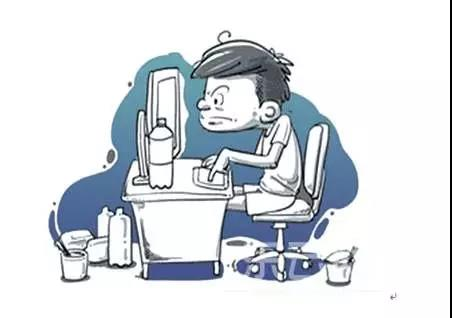
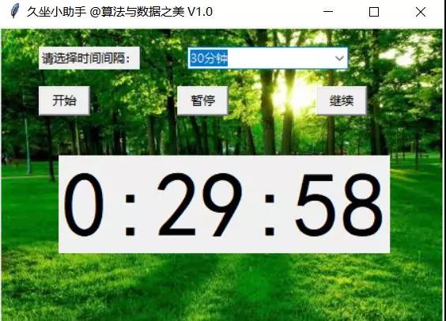
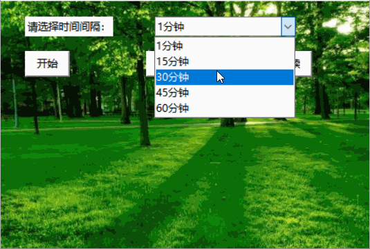
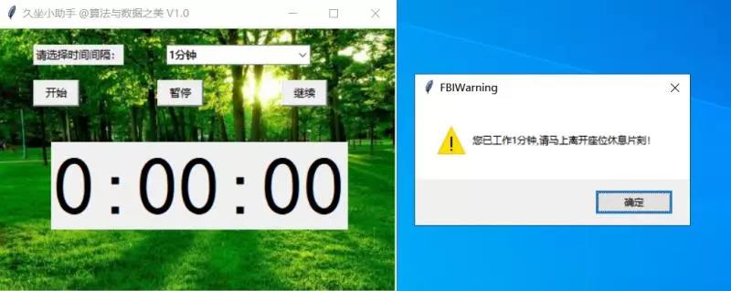

# 一、久坐小助手

不论是日常的工作还是学习，现代年轻人在电脑屏幕时长数据能让人惊掉下巴，继而引发一系列身体不适的现象。小李也是久坐族中的一员，为了时刻提醒自己起来活动活动，我开发了一款基于PythonGUI编程的久坐提醒小助手。





## 整体设计

整体的构思类似于一个番茄时钟，提供一个倒计时功能并且在完成计时时发出警告。主要分为如下几个模块，一是时间选择模块，二是按钮模块，控制计时开始、暂停以及恢复，三是倒计时显示模块，并在倒计时完成之后发出警告。



## 模块一

这一块主要是组合框的设计，并传递所选择时间的具体数值，非常简单。

```
        label2=tkinter.Label(self.win,text='请选择时间间隔：').place(x=40,y=20)
        self.cv=tkinter.StringVar()
        self.com=ttk.Combobox(self.win,textvariable=self.cv)
        self.com.place(x=190,y=20)
        self.com['value']=("15分钟","30分钟","45分钟","60分钟")
        self.com.current(0)
        self.com.bind("<<ComboboxSelected>>", self.get_time)
				
    def get_time(self,event):

        self.minute=int(self.com.get()[:-2])
```

## 模块二

这一块主要是三个按键功能的设计，是软件的核心部分。实现的功能与按钮的名称完全一致，当选择了定时的时间，按下开始按钮时，触发倒计时的秒表，并实时显示；按下暂停之后需要暂停倒计时的计数；按下继续之后需要继续倒计时的计数。



其中倒计时的计算，我是通过利用获取目标学习时长的数值加上当前时间计算得到最终计时完成的时间，本来是非常完美的，但是引入了暂停和继续开始这两项功能之后需要做出一定程度的改进，那就是倒计时的计算需要补充暂停的时长。

```
    def alarm(self):
        
        self.now=datetime.datetime.now()
        delta=datetime.timedelta(minutes=self.minute)
        self.target=self.now+delta
        self.win.after(0,self.update)
        
    def pause(self):
        
        self.pause_time=datetime.datetime.now()
        self.flag=True
        self.win.after_cancel()
        
    def go_on(self):
        
        self.go_on_now=datetime.datetime.now()
        self.pause_long=self.go_on_now-self.pause_time+self.pause_long
        self.flag=False
        self.win.after(0,self.update)

```
## 模块三

把这个倒计时显示模块放置于最醒目的位置，并在完成当前计时时发出警告的消息。核心便是下面的update函数，实现倒计时的实时更新。



```
    def update(self):
        
        now=datetime.datetime.now()
        countdown=self.target-now+self.pause_long
        self.label=tkinter.Label(self.win,text=str(countdown)[:7],font=("黑体",70))
        self.label.place(x=60,y=130)
        if str(countdown)[:7]=='0:00:00':
            tkinter.messagebox.showwarning(title="FBIWarning",message="您已工作{}分钟,请马上离开座位休息片刻！".format(self.minute))
            self.flag=True
            self.win.after_cancel()
        if self.flag==False:
            self.win.after(1,self.update)
```

最后，希望大家在工作学习之中，经常站起来活动活动筋骨，放松放松大脑，多呼吸新鲜的空气，毕竟身体才是革命的本钱！
