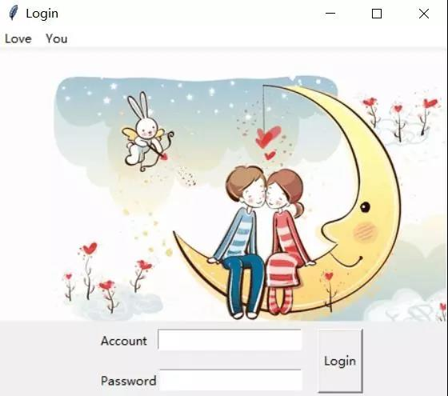
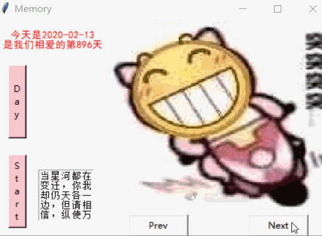
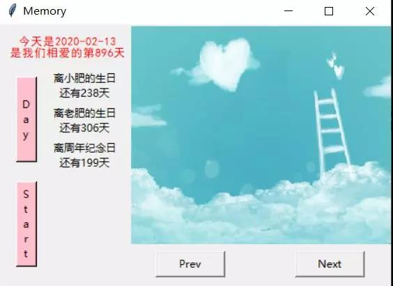

# 二、时光回忆录

受疫情影响，很多情侣即使相隔一个小区也无法见面，快递也迟迟未启动。在这情人节到来之际，宅在家中不妨自己动手做一个小软件来当作情人节礼物。


我做了这样一个“时光回忆录”，主要分为以下四部分，登录界面的设计，倒数日模块，照片模块以及甜言蜜语模块。

## 登录界面



因为照片，情话这种较为隐私的东西，我决定设计一定的登录门槛。但是与此同时，我给出了**love、you**这两个菜单栏作为账号密码的提示，通过entry控件得到输入的账号密码，并且在点击login按钮后，进入到主界面之中。


```
    def set_win(self):
        self.win.title("Login")
        self.win.geometry("450x350")
        menubar=tkinter.Menu(self.win)
        self.win.config(menu=menubar)
        menu1=tkinter.Menu(menubar,tearoff=False)
        menu2=tkinter.Menu(menubar,tearoff=False)
        for item in self.menu_list[:2]:
            if item=='account_prompt1':
                menu1.add_separator()
                menu1.add_command(label=item,command=self.get_account1)
            else:
                menu1.add_command(label=item,command=self.get_account2)
        for item in self.menu_list[2:]:
            if item=='password_prompt1':
                menu2.add_separator()
                menu2.add_command(label=item,command=self.get_password1)
            else:
                menu2.add_command(label=item,command=self.get_password2)
        menubar.add_cascade(label='Love',menu=menu1)
        menubar.add_cascade(label='You',menu=menu2)
              
        canvas=tkinter.Canvas(self.win,height=270,width=450)
        imagefile=tkinter.PhotoImage(file='a.gif')
        canvas.create_image(0,0,anchor='nw',image=imagefile)
        canvas.pack()

        account=tkinter.Variable()
        password=tkinter.Variable()

        entry1=tkinter.Entry(self.win,textvariable=account)
        entry1.place(x=160,y=280)

        entry2=tkinter.Entry(self.win,textvariable=password,show='*')
        entry2.place(x=160,y=320)

        tkinter.Label(self.win,text='Account').place(x=100,y=280)
        tkinter.Label(self.win,text='Password').place(x=100,y=320)
    
        login_button=tkinter.Button(self.win, text="Login", command=lambda :self.login(entry1,entry2), width=5, height=3)
        login_button.place(x=320,y=280)

        self.win.mainloop()
```

## 照片播放


这一模块主要是实现照片的查看，通过向前向后两个按钮控制照片的翻阅，可以将两人的合照按照时间顺序展开。需要对照片进行预处理，调整到适配的大小。

```
    def pic_process(self,path):      
        img=Image.open(path)
        img=img.resize((300,250))
        photo=ImageTk.PhotoImage(img)
        imgLabel=tkinter.Label(self.win2,image=photo)
        imgLabel.place(x=150,y=0)        
        imgLabel.after()
        
    def open_pic(self):
        self.i=0
        self.get_chp()
        self.pic_process(self.path[self.i])


    def prev_pic(self):        
        self.get_chp()
        self.i-=1
        self.pic_process(self.path[self.i])

  
    def next_pic(self):
        if self.i<40:
            self.get_chp()
            self.i+=1
            self.pic_process(self.path[self.i])
        else:
            tkinter.messagebox.showinfo(message='最后一张了喔~',title="Info")
```


## 甜言蜜语



这一模块主要是随机选择一条彩虹屁显示在文本框内，并伴随这照片的切换，进行彩虹屁的切换,当然针对每一张照片写下照片的背景，以及你的蜜语效果更佳！

```
    def get_chp(self):        
        chp=random.choice(self.CHP)
        text=tkinter.Text(self.win2,width=10,height=5)
        text.insert(tkinter.INSERT,chp)
        text.place(x=60,y=200)  
```

## 纪念日

这一个模块主要做了一个纪念日的计算，距离比较重要的日子，例如生日，结婚纪念日等的一个日期倒计时。




## 程序打包
为了使得对方能够在没有相关环境的情况下运行，我们需要将此程序进行打包处理，这里利用pyinstaller模块可以轻松做到。

```
pyinstaller -F -w -i  xxx.ico  xxxxx.py
```
其中添加-w参数可以取消启动时的命令行显示，xxx.ico则为exe文件的图标。


至此一份有心的情人节小礼物就制作完成啦！


