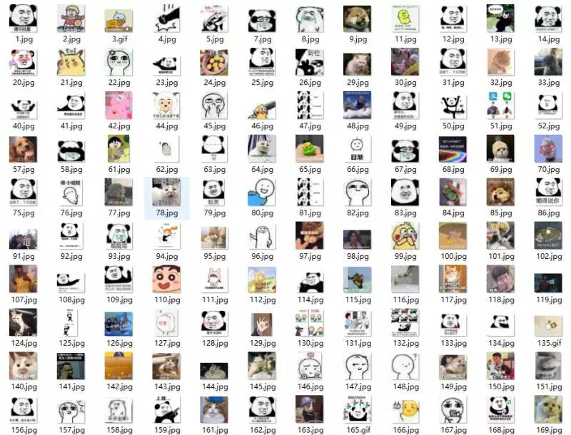
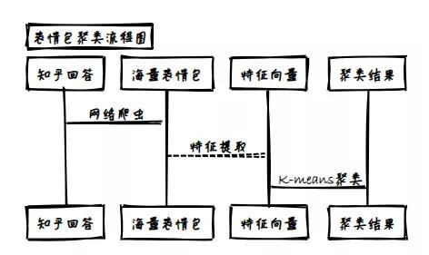
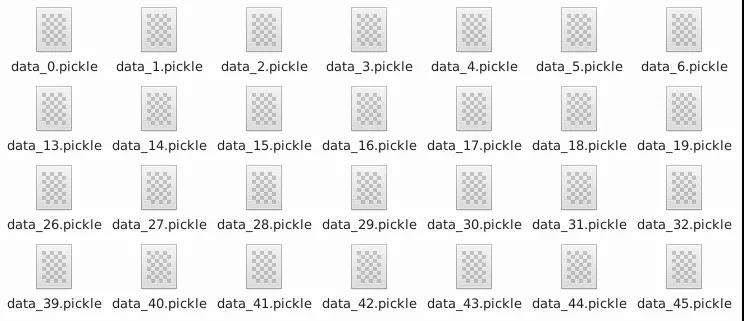
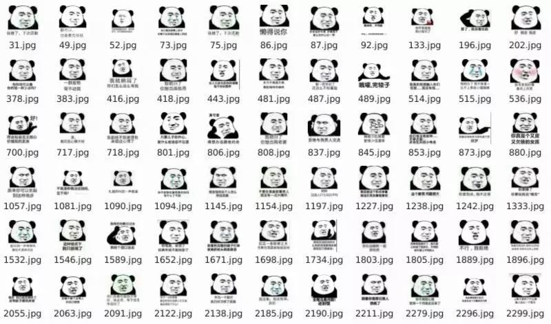
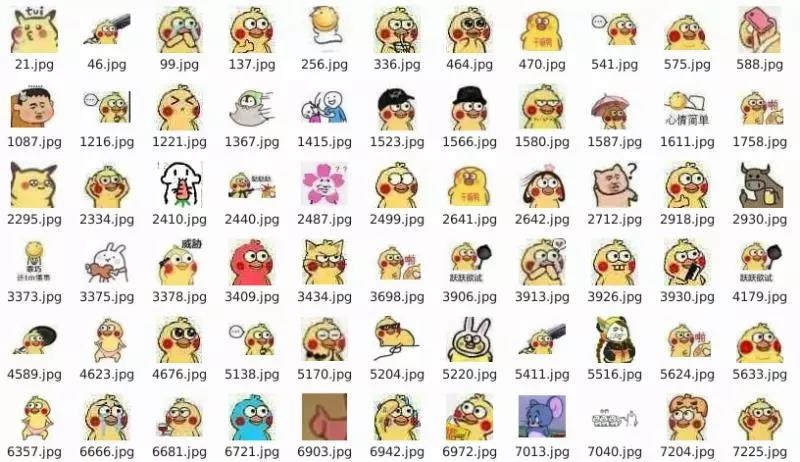
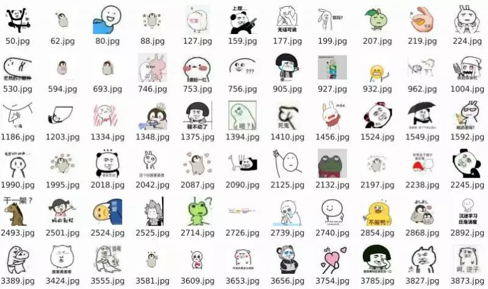
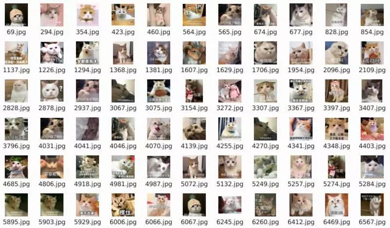
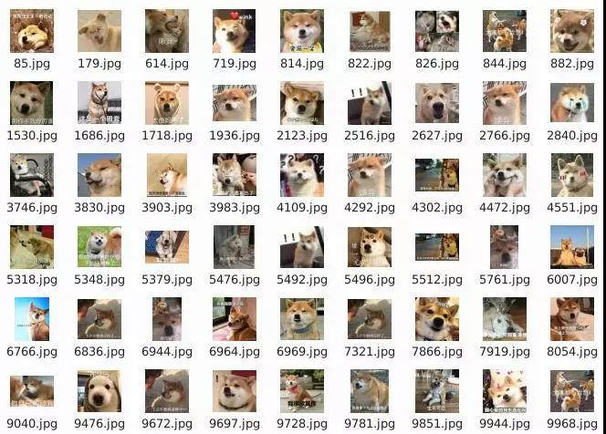
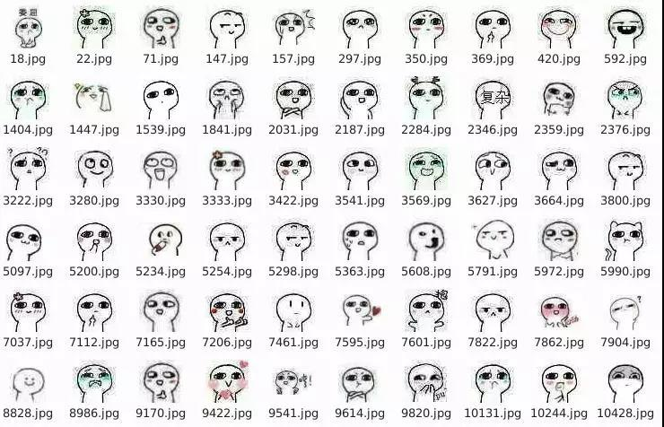
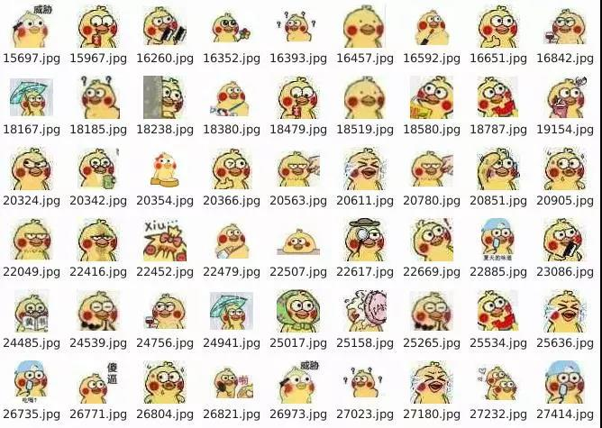

# 表情包聚类

## 实战背景

之前有写过爬取大量表情包以供广大网友斗图使用，有部分网友反映这样的表情包太乱太杂，量确实是足够的，但没有分门别类，熊猫头、杰尼龟、脆皮鹦鹉等等热门表情包都是一锅乱炖，今天我们就来做做这件事！



那这第一个想法显然是利用深度神经网络其极强的非线性**拟合能力**来完成对表情包的分类，但是很可惜，我没有能够用于训练的带标签的表情包，用人工做标注费时费力，难以令人接受。

于是，这小脑袋瓜一转我就想到了可以利用聚类算法来完成这项任务。无监督学习可以从没有任何标注的数据中学习一个模型，也就能够实现将同款表情包聚到一起。


## 系统设计

整个工程可以分为三个模块，第一个模块是**网络爬虫部分**，在知乎的表情包相关问答中爬取了50655张表情包，这里我采用了一个简单的分布式爬虫，爬取表情包的链接与通过链接下载图片这两个过程同步进行，下载这一部分利用了多线程进行下载的加速，感兴趣的同学可以点击这里回顾。第二个模块是**特征提取部分**，利用Inception v3 已经训练好的网络结构，对表情包做特征提取。第三个模块是**特征聚类部分**，直接利用K-means算法对特征进行聚类，也就是表情包的聚类。

至于模型的评估这里没有采取相应的计算公式，直接查看表情包的聚类效果，即是否同一系列的表情包被聚在了一起。

下图给出了整个系统设计的流程图。



## 特征提取

这一部分主要是利用了已经训练好的 **Inception v3** 模型，来进行特征的提取，得到每一张表情包的2048维特征向量，并保存在pickle文件之中，以便进行后续的聚类工作。这里注意给每个表情包打上数字标签，以便将特征向量聚类完成之后，实现表情包的对应聚类。

```
with tf.Session() as sess:
    """
    打开会话，进行特征提取
    
    """
    sess.run(tf.global_variables_initializer())
    tensor=sess.graph.get_tensor_by_name('pool_3/_reshape:0')
    for i in range(num_batches):
        batch_img_data=img_datas[i*batch_size:(i+1)*batch_size]
        batch_img_labels=img_labels[i*batch_size:(i+1)*batch_size]
        feature_v=[]
        for j in batch_img_data:
            j_vector=sess.run(tensor,feed_dict={'DecodeJpeg/contents:0':j})
            feature_v.append(j_vector)
        feature_v=np.vstack(feature_v)
        save_path=os.path.join(output_folder,'data_%d.pickle'%i)
        with tf.gfile.FastGFile(save_path,'w') as f:
            pickle.dump((feature_v,batch_img_labels),f)
```

程序进行一段时间的运行之后，得到了如下图所示的系列pickle文件。



## 特征聚类

好的开头就是成功的一半！我们既然已经获取了表情包对应的特征向量，下面的操作也就很容易了，只要从pickle文件中提取出特征向量，利用sklearn库已经封装好的K-means算法就可以实现聚类啦！


```
def cluster():
    """
    Kmeans做图像聚类
    """
    num_clusters=20
    model=KMeans(n_clusters=num_clusters, max_iter=30000, tol=1e-15,n_init=400, \
                    init='k-means++',algorithm='full', n_jobs=-1)
    feature_matrix,origin_labels=get_matrix()
    model.fit(feature_matrix)
    result=model.predict(feature_matrix)
```

训练完成之后，我们可以将特征对应的表情包放入同一个文件夹之中，来看看效果。







发现部分特征明显的表情包聚类的效果非常好，几乎就是同一类的表情包被准确的分在了同一个文件夹内，但是有很多的表情包未被正确分在不同的文件夹之中。于是我反复进行了模型参数的修正，并且对离群点做了舍弃的处理，得到了一些不错的结果。


## 效果展示

我们可以看到猫狗表情包也被正确的分开，聚在了不同的文件夹之中。





这种萌萌哒的表情包也聚合在一起。






但是因为表情包种类的多样性，聚类的效果依然没有特别完美，存在一些文件夹内包含许多不同种类表情包的现象。我们也可以考虑进一步地修正提升。
