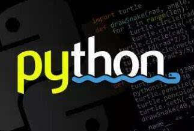

# 前言

在完成Python的基础学习之后，不知道你是否也会遇到这样的困境：

已经熟悉了基本的Python语言基础包括内置的数据类型、条件控制、循环、函数等等，但还是不能够自己动手写代码来完成某项功能或是某个任务。

本项目**python-demo-scratch**通过详尽地介绍一些Python的实战例子，旨在帮助你完成Python**从基础学习到灵活应用**的过渡。

本项目大部分例子代码都不超过**一百行**，简单、实用并且好玩！涵盖Python的多个应用领域，包括但不限于网络爬虫、数据分析、机器学习、Web开发等内容，你可以选择你感兴趣的内容来阅读，希望能给正在学习Python的你一些启发！

完整的代码可以在对应的代码仓库找到： 

[有趣的例子](https://github.com/librauee/Trick)
[网络爬虫](https://github.com/librauee/Reptile)
[数据分析](https://github.com/librauee/DataAnalysis)
[机器学习](https://github.com/librauee/DeepLearning)
[Web开发](https://github.com/librauee/Flask)

更多内容持续更新ING

**Just enjoy it!**