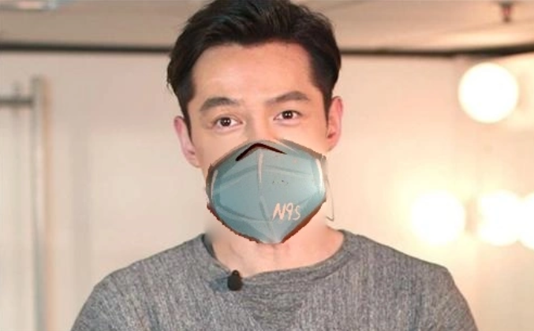

# 一、自动戴口罩

自1月20日钟南山院士肯定此次新型肺炎存在着人传人的现象起，到今日的武汉封城，我们人民群众也需要提高对此次疫情的重视程度，做好自身的防范工作，平平安安，过个好年。


尽量少去人群密集的场所，如果非要出门一定要戴上口罩，勤用肥皂和清水或含有酒精的洗手液洗手也是非常有必要的。


在网络世界中，我们可以通过给头像戴口罩，来呼吁广大群众积极保护自身安全。在这里，我们运用Python简单的几十行代码来实现在社交网络中也给自己的头像自动戴上口罩。

大致的效果如下：



用到的技术主要有人脸识别（当然，调用了接口）、openCV图像处理这两项。

## 人脸识别

旷视提供了人脸识别的API，输入图片便可以得到人脸的各个稠密关键点的所在位置，通俗来讲，就是勾画出五官。


我们通过使用其嘴巴的位置数据，可以定位口罩的佩戴位置。并通过计算人脸嘴巴的大小，自动调整口罩的大小进行适配。

```
def get_mouth(dst_pic):
    with open(dst_pic, 'rb') as f:
        base64_data = base64.b64encode(f.read())
    url='https://api-cn.faceplusplus.com/facepp/v1/face/thousandlandmark'
    headers={'user-agent': 'Mozilla/5.0 (Windows NT 10.0; Win64; x64) AppleWebKit/537.36 (KHTML, like Gecko) Chrome/76.0.3809.132 Safari/537.36'}
    data={
		     # api_key,api_secret需自己申请
          'api_key':'',
          'api_secret':'',
          'return_landmark': 'mouth',
          'image_base64': base64_data
                         }
    r=requests.post(url,headers=headers,data=data)
    mouth=r.json()['face']['landmark']['mouth']
    x,y=[],[]
    for i in mouth.values():
        y.append(i['y'])
        x.append(i['x'])
    y_max=max(y)
    y_min=min(y)
    x_max=max(x)
    x_min=min(x)
    middle_x=int((x_max+x_min)/2)
    middle_y=int((y_max+y_min)/2)
    size=(int(3*(x_max-x_min)),int(5*(y_max-y_min)))
    return (middle_x,middle_y),size
```

## 图像处理

有了口罩的估计大小，可以自动更改口罩的图像大小，根据计算得到的口罩的中心位置来摆放口罩，并通过简单的**掩膜**处理，利用seamlessClone函数将口罩照片添加到头像图片上。

```
def add_mask(img_path,img_outPath):
    src_pic="/root/Documents/abc.jpg"
    center,size=get_mouth(img_path)
    src=cv2.imread(src_pic)
    src=cv2.resize(src,size)
    dst=cv2.imread(img_path)
    # 掩膜mask
    mask=255*np.ones(src.shape, src.dtype)
    output=cv2.seamlessClone(src, dst, mask, center, cv2.NORMAL_CLONE)
    cv2.imwrite(img_outPath, output)
```
当然，这只是一个小demo, 有许多地方可以改进，例如我们可以根据鼻梁的倾斜程度判断人脸的倾斜程度，从而对口罩做相应的旋转操作，更加适配人脸。