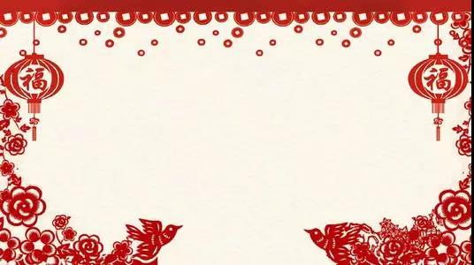
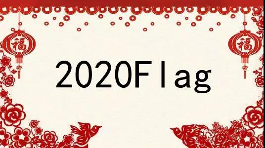
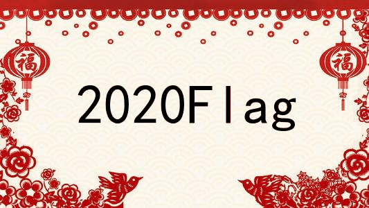

# 二、做自己的专属Flag动图

2020年的开头并不顺利，有不少朋友希望能够重启2020。然而时光不可倒流，我们都应该学会积极的向前看。

我们可以给自己的2020年立下Flag,或者说给自己在这剩下的11个月里定下小目标，并不断为之努力。


今天我们就用这万能的Python来做自己的2020专属Flag动图。整个动图制作可以分为如下几步，将愿望写入图片，循环播放图片形成gif的效果或者直接合成图片生成动图。

## 图片制作

我找了一张符合主题的背景图，简单而不失优雅的中国红，福气满满的剪纸画。



以此图为背景，在中央空白处写下自己的愿望，即给图片添加文字，这里用到了pillow库来新建画布，并描绘出黑色字体。

```
def add_font(text,i):
    font=ImageFont.truetype('simhei.ttf', 80) 
    img=Image.open('a.jpg')
    draw=ImageDraw.Draw(img) 
    draw.text((110,110),text,(0,0,0),font=font)
    img.save('pic/{}.png'.format(i))
```

其文本位置和大小以及字体都可以在代码中进行控制，整体效果如下，




## 图片轮播

想要达到gif的效果，最直接的想法便是将图片不断地播放，这里我们用到了另外一个图像处理的常用库opencv，cv2.waitKey()函数在参数不为零的时候可以和循环结合产生动态画面，即**图片轮播**。

```
def pic_cycle():
    path="pic"
    filenames=os.listdir(path)
    img_iter=cycle([cv2.imread(os.sep.join([path, x])) for x in filenames])
    while 1:
        cv2.imshow('window title', next(img_iter))
        cv2.waitKey(500)
```

通过itertools.cycle生成一个无限循环的迭代器，每一次迭代都输出下一张图片，通过更改cv2.waitKey的参数，可以调整图片轮播的速度。

## 图片合成

如果不但想要生成动图的效果，还想要直接以gif的形式保存下来便可以用到imageio库，这个库提供了多张图片合成gif动图的函数mimsave，可以通过调节参数fps调节图片轮播的速度。
```
def make_gif():
    gif_images=[]
    img_paths=os.listdir('pic')
    img_paths=[os.sep.join(['pic',i]) for i in img_paths]
    for path in img_paths:
        gif_images.append(imageio.imread(path))
    imageio.mimsave("a.gif",gif_images,fps=2)

```

## 效果展示
我在代码中写入了自己的Flag, 你们也来动手制作吧！


