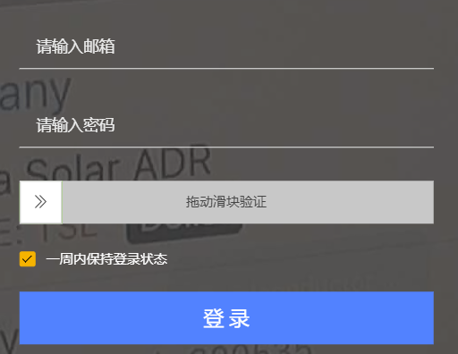
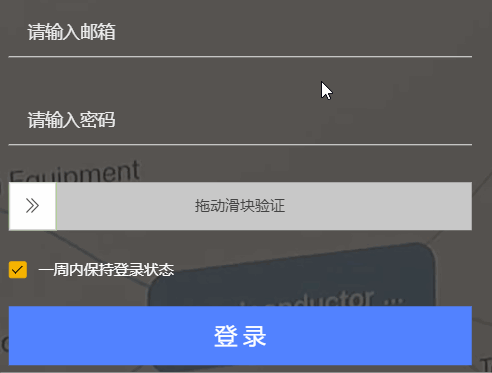

# 三、换个姿势模拟登录

今天给大家介绍Python一个非常有意思的库**PyUserInput**，它集成了PyMouse和PyKeyboard这俩模块，能够模拟鼠标和键盘的操作，可以说是轻量级的按键精灵。我们可以用这个库来进行一些机械的重复操作，也可以作为小游戏的脚本。俗话说得好，工欲善其事，必先利其器，我们需要先将PyUserInput安装。

## 模块安装

不同的操作系统需要安装不同的依赖：

* Linux - Xlib
* Mac - Quartz,AppKit
* Windows - pywin32,pyHook

在Windows系统中，pywin32是已经默认安装的，我们仅需要安装pyHook，

[pyHook下载链接](https://www.lfd.uci.edu/~gohlke/pythonlibs/#pyhook)

在此页面下载与自己电脑相匹配的版本，并进入该whl文件所在位置，输入命令即可成功安装。
```
pip install xxxxxx.whl
```
安装完依赖之后，我们只要在命令行输入如下命令即可大功告成。
```
pip install PyUserinput
```

## 简单使用
首先，导入pymouse和pykeyboard库，并创建鼠标以及键盘对象。
```
from pymouse import PyMouse
from pykeyboard import PyKeyboard

m = PyMouse()
k = PyKeyboard()
```
* 鼠标

```
x_dim, y_dim = m.screen_size()     
# 获取屏幕尺寸
m.move(100, 100)   
# 移动鼠标到某坐标，该坐标以左上角为（0,0）
m.click(100, 100, 1, 1)  
# 在(100, 100)的位置单击左键一次
```

在click方法中，前两个参数为位置的坐标，第三个参数为按键选项，1表示鼠标左键，2表示右键，而最后一个参数表示点击的次数。

* 键盘

```
k.type_string("Laofei NB!")   #输入字符串
k.press_key("S")              #按下S键 
k.release_key("S")            #松开S键 
k.tap_key("S")                #点击S键
```

另外还可以有组合按键，比如最常用的复制Ctrl+C。我们先按下Ctrl键，再点击C键，最后释放Ctrl键，一气呵成，完成这人生中最幸福的操作之一：**复制**。

```
k.press_key(k.control_key)
k.tap_key('c')
k.release_key(k.control_key)
```

## 模拟登录

在完成前面的基础学习之后，我们来实战一下用Python模拟鼠标键盘的操作。以前都用Selenium，今天就换个姿势来模拟登录~



这个思路应该是非常清晰的，先用鼠标实现定位，键盘输入邮箱账号以及密码，接着利用鼠标拖动滑块至底部，最后再点击登录按钮实现登录。

```
# 输入邮箱账号以及密码
m.move(590,370)
m.click(590,370,1,1)
k.type_string('laofei@520.com')
time.sleep(1)
m.move(590,440)
m.click(590,440,1,1)
k.type_string('memeda')
time.sleep(1)
# 拖动滑块
m.move(590,510)
m.press(590,510,1)
time.sleep(1)
m.move(1000,500)
time.sleep(2)
# 点击登录按钮
m.click(590,600)
```



完美！
